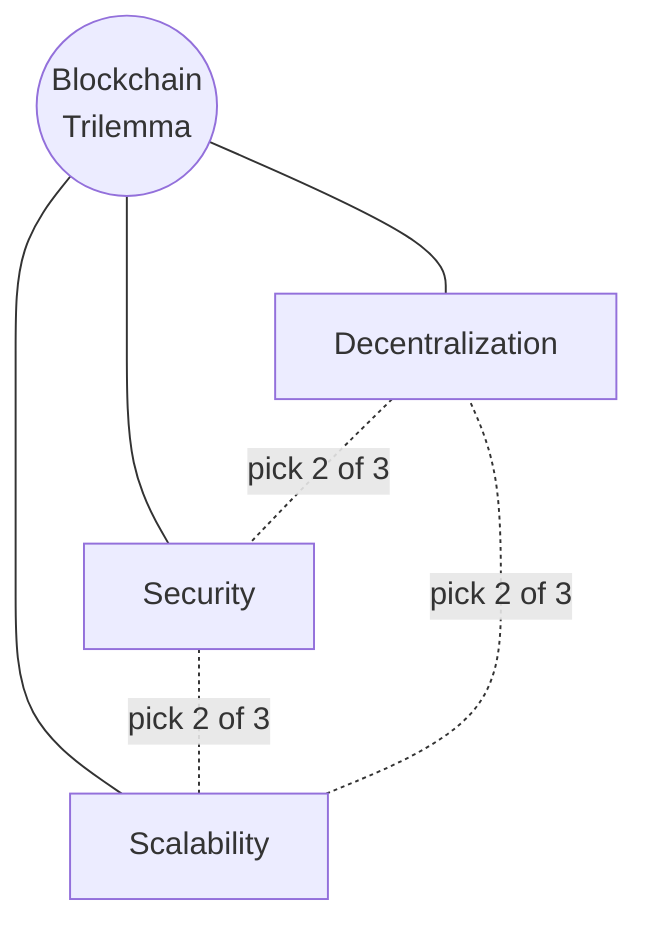
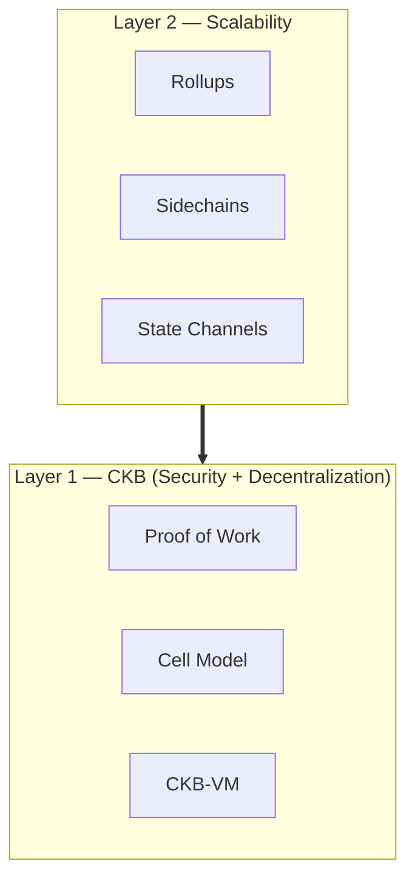
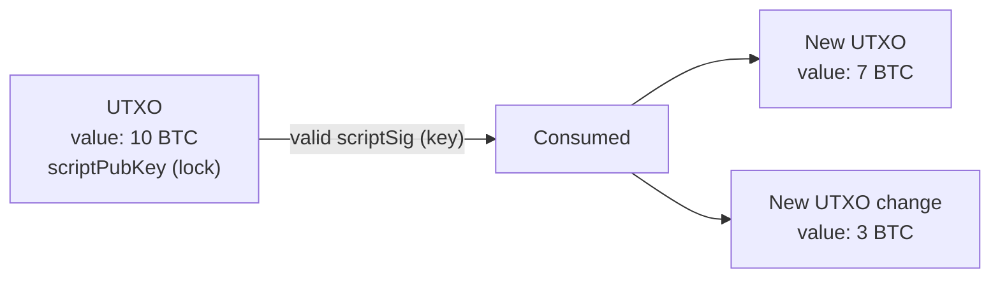
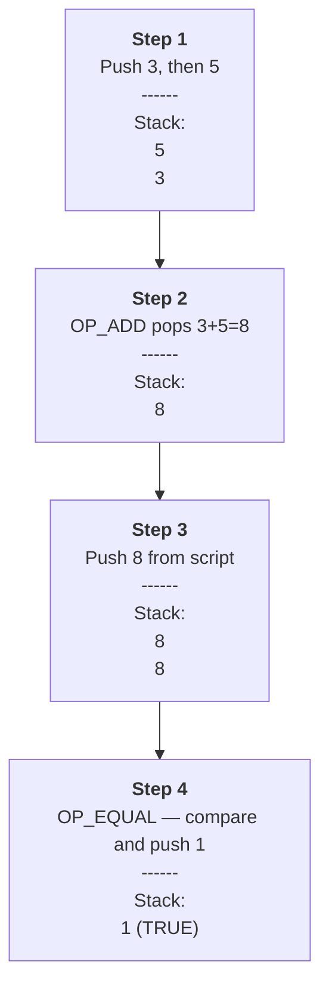
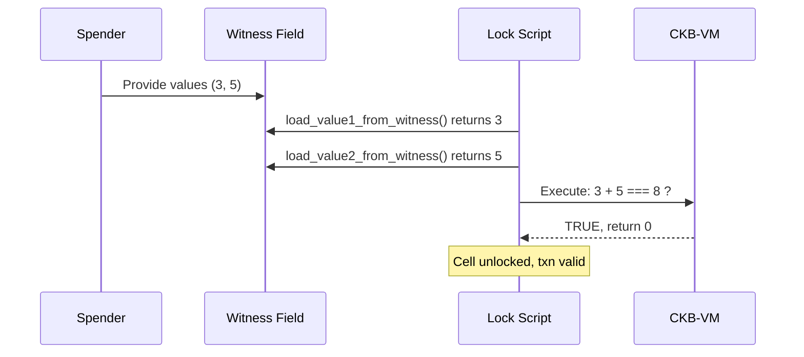
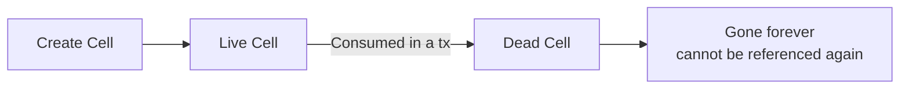
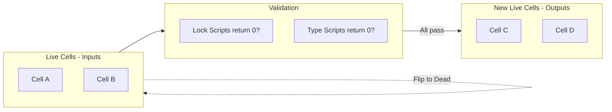
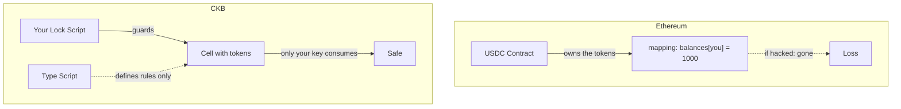
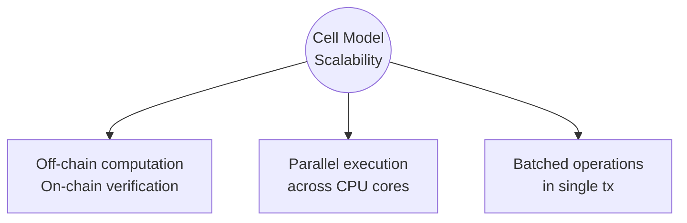

# Nervos CKB — Learning Notes

## Nervos Common Knowledge Base (CKB)

CKB is a **Layer 1 blockchain** designed around one of the hardest problems in crypto: the **blockchain trilemma**.

### The Blockchain Trilemma

It's very hard to simultaneously achieve **decentralization**, **security**, and **scalability** in a single blockchain. Most systems can only optimize for two out of the three.



### The Multilayered Solution

One approach to solving the trilemma is to split responsibilities across layers: a base layer (**L1**) focused on security and decentralization, with secondary layers (**L2s**) built on top to handle scalability. This is what Ethereum did, and it's also what CKB does.



CKB itself focuses on security and decentralization. Developers can build L2s on top of it to make the overall system more scalable.

### Key Facts About CKB

- **Consensus**: Proof of Work
- **Native Token**: CKByte
  - 1 CKByte entitles the holder to **1 byte of on-chain storage**
  - Used to pay gas fees on the CKB blockchain
  - Can be staked in the **Nervos DAO** to earn rewards
- **Virtual Machine**: **CKB-VM**, based on **RISC-V** — this is where smart contracts execute

---

## CKB vs BTC

### Bitcoin's UTXO Model

Bitcoin uses **Bitcoin Script**, a stack-based language that's intentionally limited — you can write simple spending rules, but you can't build complex applications with it.

Bitcoin also uses the **UTXO (Unspent Transaction Output)** model, which is very different from Ethereum's account model.

**How UTXOs work:**



To spend Bitcoin, you don't actually "spend" anything — you **consume an existing UTXO and create new ones**. Each UTXO has:

- A **value** (amount of BTC)
- A **scriptPubKey** — a lock with conditions to unlock

To unlock a UTXO, you provide a valid **scriptSig** (script signature) that satisfies the scriptPubKey.

### Example: Bitcoin Script Execution

Say a UTXO has this locking script:

```json
{
  "value": 8,
  "scriptPubKey": "OP_ADD <8> OP_EQUAL"
}
```

To unlock it, the spender provides this unlocking script:

```
OP_3 OP_5
```

Bitcoin's interpreter runs this in a **stack-based manner**:



The transaction is valid because the stack ends with TRUE.

**The limitation:** Bitcoin Script can only express simple rules. There are no loops, no real function calls, no rich data structures — so you can't build dApps with it.

### CKB's Cell Model

CKB uses the **Cell model**, which is a generalization and improvement of the UTXO model.

A Cell looks like this:

```json
{
  "capacity": "0x19995d0ccf",
  // Size of the Cell in shannons (1 CKB = 10^8 shannons)

  "lock": {
    // A Script defining ownership of the Cell
    "code_hash": "0x9bd7e06f3ecf4be0f2fcd2188b23f1b9fcc88e5d4b65a8637b17723bbda3cce8",
    // points to the code you wrote
    "args": "0x0a486fb8f6fe60f76f001d6372da41be91172259",
    "hash_type": "type"
  },

  "type": null
  // An optional Script defining the type of the Cell
}
```

Key idea: instead of a fixed scripting language, a Cell's `lock` points to **arbitrary code** running on CKB-VM.

### Same Example — CKB Style

Let's do the same "add two numbers and check if they equal 8" transaction on CKB. The sender writes a **lock script** (pseudocode):

```javascript
const v1 = load_value1_from_witness();
const v2 = load_value2_from_witness();
const result = v1 + v2;

if (result === 8) {
  return 0;  // 0 = success, unlocks the cell
}
return 1;    // 1 = failure
```

To unlock, the spender provides values (e.g., `3` and `5`) in the **witness** field. The script loads them, executes on CKB-VM, and returns 0 (success) or 1 (failure).



### The Big Difference

| | Bitcoin Script | CKB Lock Script |
|---|---|---|
| **Language** | Stack-based, limited opcodes | Real programming language, compiled to RISC-V |
| **Expressiveness** | Simple spending rules only | Arbitrary logic — loops, functions, data structures |
| **Use case** | Lock/unlock BTC | Lock/unlock cells + build full dApps |
| **Model** | UTXO | Cell (generalized UTXO) |

On CKB, contracts are written in **real programming languages**, allowing complex transactions and full decentralized applications — while keeping the security benefits of the UTXO-style model.

# Cell Model — Notes

## The Core Idea

**Cells are immutable.** Once on-chain, a Cell can never be changed. To "update" data, you destroy the old Cell and create a new one in its place. This process is called **Consumption**.

## Cell Lifecycle



- **Live Cell** — exists on-chain, unspent, available to be consumed
- **Dead Cell** — already consumed, now historical record only
- Each Cell can be consumed **exactly once**

## What a Transaction Actually Does

A CKB transaction is just a declaration:

> "Consume these Live Cells → create these new Cells in their place."

The network validates by running:
1. **Every Lock Script** on every input Cell → must return `0` (spender authorized)
2. **Every Type Script** involved → must return `0` (state transition legal)

If both pass: inputs flip Live → Dead, outputs become new Live Cells.



---

## First-Class Assets — The Big Security Property

This is what makes CKB fundamentally different from Ethereum.

### Ethereum model
Your USDC isn't really *yours*. It's an entry in the USDC contract's mapping:
```
balances[your_address] = 1000
```
The contract owns the tokens. You have a *claim*. If the contract is hacked or upgraded maliciously → balance gone.

### CKB model
Your tokens live in **Cells locked by your Lock Script**. Your Lock Script says: *"only the holder of this private key can consume this Cell."*

- **Type Script** = rules about how tokens move (supply, transfer rules)
- **Lock Script** = who controls the Cell

A buggy Type Script **cannot bypass your Lock**. Contracts enforce *rules*; they don't *hold* your stuff.



### The trade-off: State Rent
Because your assets occupy bytes on-chain (Cell capacity = storage quota = locked CKB), you pay a **continuous upkeep cost** for the bytes you occupy. You're not paying once — you're paying forever for the space.

> Note: In practice this is implemented as **secondary issuance** — holders who don't lock CKB in the Nervos DAO get diluted over time. Functionally equivalent to state rent.

---

## Flexible Transaction Fees

**Ethereum:** Sender always pays gas → onboarding problem (need ETH first).

**CKB:** *Any party* can attach the CKBytes that pay the fee.

| Who pays | Use case |
|---|---|
| Sender | Normal case |
| Receiver | Claiming an airdrop |
| Third party | Sponsored / gasless transactions |

**How it works:** A tx just needs `sum(input capacities) ≥ sum(output capacities) + fee`. The protocol doesn't care *whose* inputs they are, as long as the math works and every Lock Script signs off.

---

## Scalability — Three Distinct Properties

### 1. Off-chain computation, on-chain verification
- **Ethereum:** Every node runs the computation (expensive)
- **CKB:** The tx creator computes the new state *off-chain*; the network just *verifies* the result by running scripts in validation mode
- Verifying ≪ computing from scratch (same idea behind ZK rollups, but at base layer)

### 2. Parallel execution
- **Ethereum:** Txs run sequentially (might touch same storage)
- **CKB:** Every tx declares *exactly* which Cells it touches — no hidden side effects
- If tx A's inputs and tx B's inputs don't overlap → validate **simultaneously** on different CPU cores
- Modern hardware has many cores → CKB uses them

### 3. Batched operations
- One tx can have many inputs/outputs with many Type Scripts
- Settle 50 DEX trades in one tx. Mint + transfer + burn in one tx.
- Fee scales with **size**, not with **number of operations**



---

## How This Connects to Earlier Concepts

| You learned | This page explains |
|---|---|
| Cell has `lock` + optional `type` | *Why* the split matters → first-class assets |
| Tx has `inputs` and `outputs` | Inputs become Dead, outputs become new Live Cells |
| Tx has `capacity` math | Why anyone can pay fees — it's just sum balancing |
| Scripts return 0 or non-0 | This is what gates Consumption |

**Previous page told you what a Cell *looks like*. This page told you what a Cell *does*.**

---

## Quick Recall Checklist

- [ ] What does "Cell is immutable" mean in practice?
- [ ] What's the difference between a Live and Dead Cell?
- [ ] Why are CKB assets "first-class" but Ethereum assets aren't?
- [ ] What is state rent, and why does it exist?
- [ ] Who can pay tx fees on CKB?
- [ ] Name the three scalability properties of the Cell Model.
- [ ] Why can CKB execute transactions in parallel but Ethereum can't?

---

## Caveats Worth Remembering

1. **State rent ≠ literal recurring charge.** It's implemented as secondary issuance + Nervos DAO dilution offset.
2. **"Off-chain computation" ≠ rollup or L2.** It just means tx creators compute the proposed new state themselves.
3. **Parallel execution has limits.** If many txs fight for the same Cell, you still serialize. Good protocol design uses Cells that don't bottleneck.
