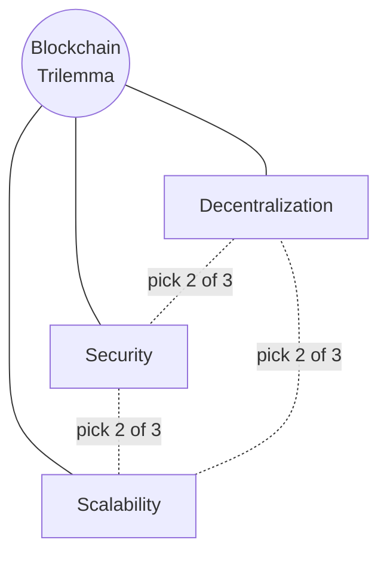
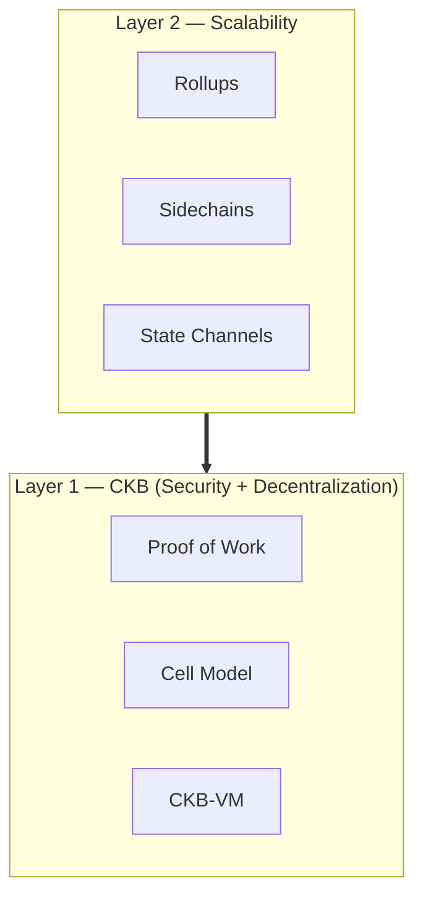
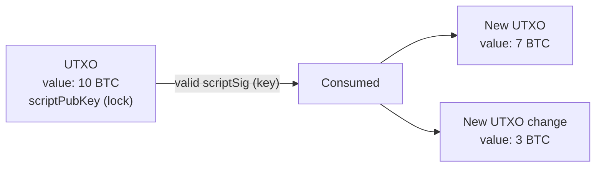
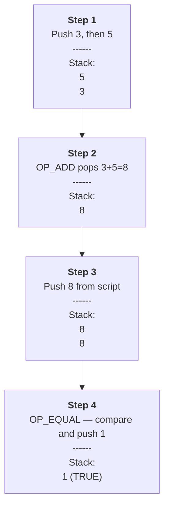
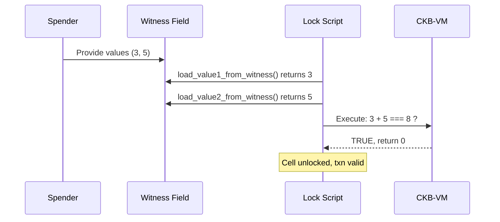

# Nervos CKB — Learning Notes

## Nervos Common Knowledge Base (CKB)

CKB is a **Layer 1 blockchain** designed around one of the hardest problems in crypto: the **blockchain trilemma**.

### The Blockchain Trilemma

It's very hard to simultaneously achieve **decentralization**, **security**, and **scalability** in a single blockchain. Most systems can only optimize for two out of the three.



### The Multilayered Solution

One approach to solving the trilemma is to split responsibilities across layers: a base layer (**L1**) focused on security and decentralization, with secondary layers (**L2s**) built on top to handle scalability. This is what Ethereum did, and it's also what CKB does.



CKB itself focuses on security and decentralization. Developers can build L2s on top of it to make the overall system more scalable.

### Key Facts About CKB

- **Consensus**: Proof of Work
- **Native Token**: CKByte
  - 1 CKByte entitles the holder to **1 byte of on-chain storage**
  - Used to pay gas fees on the CKB blockchain
  - Can be staked in the **Nervos DAO** to earn rewards
- **Virtual Machine**: **CKB-VM**, based on **RISC-V** — this is where smart contracts execute

---

## CKB vs BTC

### Bitcoin's UTXO Model

Bitcoin uses **Bitcoin Script**, a stack-based language that's intentionally limited — you can write simple spending rules, but you can't build complex applications with it.

Bitcoin also uses the **UTXO (Unspent Transaction Output)** model, which is very different from Ethereum's account model.

**How UTXOs work:**



To spend Bitcoin, you don't actually "spend" anything — you **consume an existing UTXO and create new ones**. Each UTXO has:

- A **value** (amount of BTC)
- A **scriptPubKey** — a lock with conditions to unlock

To unlock a UTXO, you provide a valid **scriptSig** (script signature) that satisfies the scriptPubKey.

### Example: Bitcoin Script Execution

Say a UTXO has this locking script:

```json
{
  "value": 8,
  "scriptPubKey": "OP_ADD <8> OP_EQUAL"
}
```

To unlock it, the spender provides this unlocking script:

```
OP_3 OP_5
```

Bitcoin's interpreter runs this in a **stack-based manner**:



The transaction is valid because the stack ends with TRUE.

**The limitation:** Bitcoin Script can only express simple rules. There are no loops, no real function calls, no rich data structures — so you can't build dApps with it.

### CKB's Cell Model

CKB uses the **Cell model**, which is a generalization and improvement of the UTXO model.

A Cell looks like this:

```json
{
  "capacity": "0x19995d0ccf",
  // Size of the Cell in shannons (1 CKB = 10^8 shannons)

  "lock": {
    // A Script defining ownership of the Cell
    "code_hash": "0x9bd7e06f3ecf4be0f2fcd2188b23f1b9fcc88e5d4b65a8637b17723bbda3cce8",
    // points to the code you wrote
    "args": "0x0a486fb8f6fe60f76f001d6372da41be91172259",
    "hash_type": "type"
  },

  "type": null
  // An optional Script defining the type of the Cell
}
```

Key idea: instead of a fixed scripting language, a Cell's `lock` points to **arbitrary code** running on CKB-VM.

### Same Example — CKB Style

Let's do the same "add two numbers and check if they equal 8" transaction on CKB. The sender writes a **lock script** (pseudocode):

```javascript
const v1 = load_value1_from_witness();
const v2 = load_value2_from_witness();
const result = v1 + v2;

if (result === 8) {
  return 0;  // 0 = success, unlocks the cell
}
return 1;    // 1 = failure
```

To unlock, the spender provides values (e.g., `3` and `5`) in the **witness** field. The script loads them, executes on CKB-VM, and returns 0 (success) or 1 (failure).



### The Big Difference

| | Bitcoin Script | CKB Lock Script |
|---|---|---|
| **Language** | Stack-based, limited opcodes | Real programming language, compiled to RISC-V |
| **Expressiveness** | Simple spending rules only | Arbitrary logic — loops, functions, data structures |
| **Use case** | Lock/unlock BTC | Lock/unlock cells + build full dApps |
| **Model** | UTXO | Cell (generalized UTXO) |

On CKB, contracts are written in **real programming languages**, allowing complex transactions and full decentralized applications — while keeping the security benefits of the UTXO-style model.
