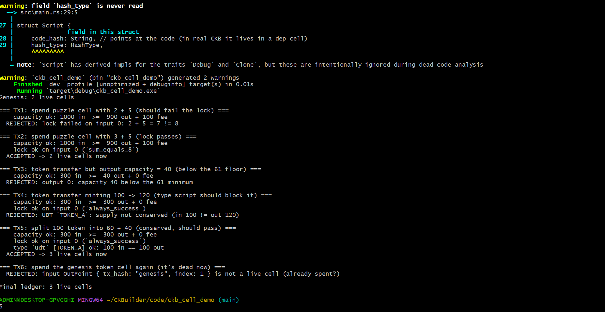

# Week 2 Progress


## What I worked on

### CKB Academy — Completed!
- Finished the remaining modules 6, 7 and 8 this week — officially completed all 8 modules of the CKB Academy
- The final stretch was a deep dive into the **structure of a Cell and a Transaction** — going field by field rather than staying at the conceptual level of week 1
- Studied the **Script structure** (`code_hash`, `hash_type`, `args`), how scripts are located and executed, and how the protocol groups and runs them

### CCC Playground
- Started exploring the CCC Playground examples to begin building transactions in practice
- Got partially through the interactive examples — still working through some of them
- Planning to complete the remaining examples next week

---

## Key learnings

### Cell & Capacity
- Understood that **capacity does two jobs at once**: it is both the CKB balance and the byte-quota the Cell may occupy on-chain — money and storage are the same thing
- Learned the validation rule `capacity_in_bytes >= len(capacity) + len(data) + len(type) + len(lock)` and the **61 CKByte minimum** every Cell must reserve for its base fields

### Scripts — Lock vs Type
- A **Script is a pointer to code, not the code itself** — the binary lives in a separate code Cell and is referenced by hash
- **Lock Script** = ownership, runs **only on inputs** (you only prove authorisation when spending)
- **Type Script** = state-transition rules, runs on **both inputs and outputs** (it must check the before and after state, e.g. UDT supply conservation)
- This lock/type split is exactly *where* the "first-class assets" property from week 1 lives in the data structure

### Code location — `code_hash` + `hash_type`
- **Data hash** (`data`/`data1`/`data2`) → immutable reference to exact binary bytes, also pins the VM version
- **Type hash** (`type`) → upgradeable reference that follows the newest code under a given Type Script
- Learned the **Type ID** pattern for making an upgradeable code Cell a safe singleton, and that the immutable/upgradeable choice mirrors the immutable-vs-proxy-contract trade-off in Ethereum

### Transaction anatomy
- Walked through every field: `cell_deps`, `header_deps`, `inputs` (with `since` timelocks), `outputs`, `outputs_data`, and `witnesses`
- **`cell_deps` + `dep_type`** (`code` vs `dep_group`) — how a tx attaches the code its scripts need, with `dep_group` bundling multiple deps into one reference
- **Witnesses & WitnessArgs** — the `lock` / `input_type` / `output_type` slots, why there are exactly three, and how the witness index lines up with script groups so multiple scripts can share a witness without colliding
- **Script Group Execution & syscalls** — inputs are grouped by script and run once per group; scripts read transaction data through `ckb_load_*` syscalls (`CKB_SOURCE_INPUT`, `CKB_SOURCE_GROUP_INPUT`, etc.)

### Framing against Bitcoin & Ethereum
- Throughout, I anchored each concept against how **Bitcoin** (UTXO, `scriptPubKey`, SegWit witnesses, nLockTime, coinbase tx) and **Ethereum** (account model, upgradeable proxies, single-signer txs) handle the same problem — this comparison is what made the structure stick
- Full notes written up in [notes/structures.md](../notes/structures.md)

---

## Practical work — applied it in Rust

To make the structure concepts concrete (and to keep practising Rust), I built a small
**Rust simulation of the CKB Cell Model** — code in [code/ckb_cell_demo/](../code/ckb_cell_demo/).
It models cells, lock vs type scripts, capacity rules and live → dead consumption, then runs
6 transactions that each exercise one rule (some pass, some are rejected on purpose).

Run with `cargo run`. Output:



```text
Genesis: 2 live cells

=== TX1: spend puzzle cell with 2 + 5 (should fail the lock) ===
    capacity ok: 1000 in  >=  900 out + 100 fee
  REJECTED: lock failed on input 0: 2 + 5 = 7 != 8

=== TX2: spend puzzle cell with 3 + 5 (lock passes) ===
    capacity ok: 1000 in  >=  900 out + 100 fee
    lock ok on input 0 (`sum_equals_8`)
  ACCEPTED -> 2 live cells now

=== TX3: token transfer but output capacity = 40 (below the 61 floor) ===
    capacity ok: 300 in  >=  40 out + 0 fee
  REJECTED: output 0: capacity 40 below the 61 minimum

=== TX4: token transfer minting 100 -> 120 (type script should block it) ===
    capacity ok: 300 in  >=  300 out + 0 fee
    lock ok on input 0 (`always_success`)
  REJECTED: UDT `TOKEN_A`: supply not conserved (in 100 != out 120)

=== TX5: split 100 token into 60 + 40 (conserved, should pass) ===
    capacity ok: 300 in  >=  300 out + 0 fee
    lock ok on input 0 (`always_success`)
    type `udt` [TOKEN_A] ok: 100 in == 100 out
  ACCEPTED -> 3 live cells now

=== TX6: spend the genesis token cell again (it's dead now) ===
  REJECTED: input OutPoint { tx_hash: "genesis", index: 1 } is not a live cell (already spent?)

Final ledger: 3 live cells
```

What each transaction proves:

| TX  | Rule under test                    | Result   |
| --- | ---------------------------------- | -------- |
| TX1 | Lock script: `2 + 5 ≠ 8`           | REJECTED |
| TX2 | Lock script: `3 + 5 = 8`           | ACCEPTED |
| TX3 | Min capacity (61 CKByte floor)     | REJECTED |
| TX4 | Type script: minting `100 → 120`   | REJECTED |
| TX5 | Type script: split `100 → 60 + 40` | ACCEPTED |
| TX6 | Spending an already-dead cell      | REJECTED |

This tied the week's reading directly to code: lock scripts gating inputs, type scripts
enforcing supply across inputs + outputs, the 61-byte floor, and live → dead consumption.

---

## Blockers
- None this week

---

## Next week
- Finish the remaining CCC Playground examples
- Build a transaction by hand including a Type Script and place the witness manually
- Experiment with deploying my own code Cell (`code` vs `dep_group`) and a Type ID upgradeable script
